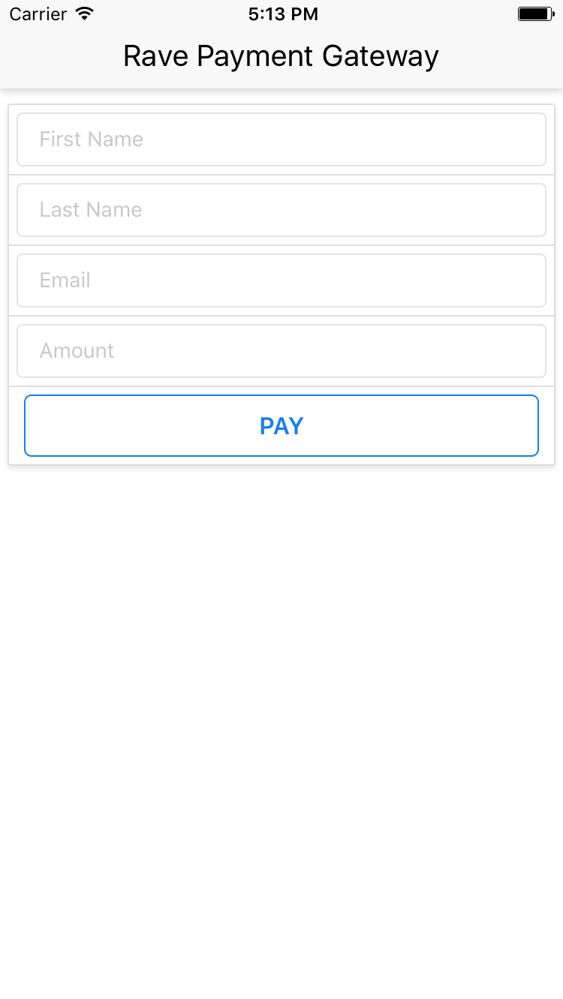
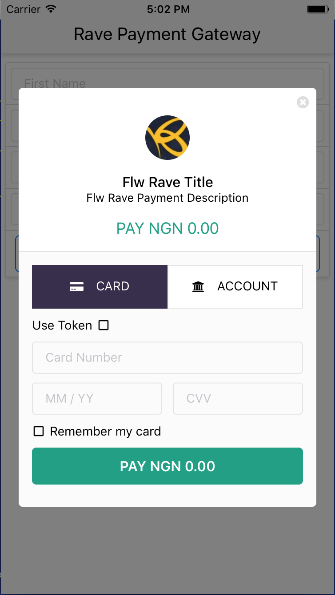
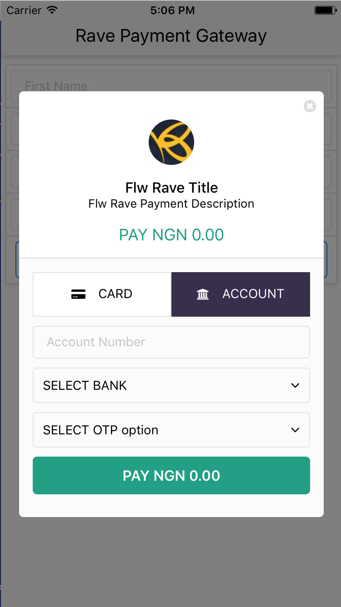
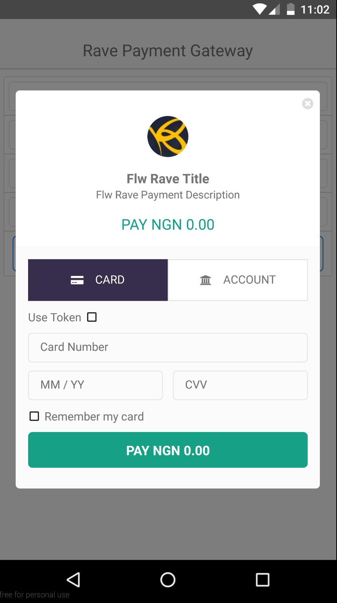
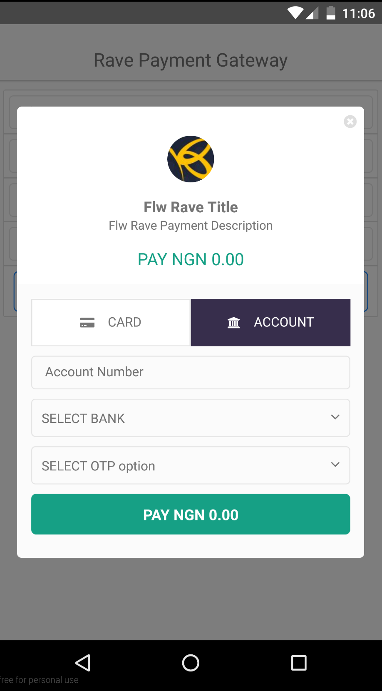

# RavePaymentGateWay
Rave payment gateway quick checkout for ReactNative application is an easy to implement plugin to interact with [Flutterwave](https://www.flutterwave.com/) payment API. It comes with in-built UI to collect debit card, credit card or bank details.

***




***




## Installation
You can integrate RavePaymentGateway into ReactNative application manually. 
The RavePaymentGateway, requires the crypto module which is a built-in Node module. React Native runs JS on JavaScriptCore (when on the device or simulator) and on Chrome itself (when using Chrome debugging), so modules that depend on built-in Node.js modules won't work.  We have to port the crypto module to React Native and install other dependencies.

A typical workflow:

1. Install other dependencies
  ```sh
  npm i --save underscore react-native-vector-icons cryptico
  #link the installed icons to your application
  react-native link
  ```


2. To port the `crypto` module to your RN application, do the following
  ```sh
  npm i --save react-native-crypto
  # Install peer deps
  npm i --save react-native-randombytes
  react-native link react-native-randombytes
  # Install latest rn-nodeify
  npm i --save-dev mvayngrib/rn-nodeify
  # Install node core shims and recursively hack package.json files
  # in ./node_modules to add/update the "browser"/"react-native" field with relevant mappings
  ./node_modules/.bin/rn-nodeify --hack --install
  ```

3.  Verify that a `shim.js` in the project root directory is created
 
```
Note: Checkout [react-native-crypto](https://github.com/mvayngrib/react-native-crypto) for more
```


4. Drag the `src` folder to the root of your application. Or if you already have a `src` folder then copy the contents over to your application

## Basic usage 
This however depends on how the entry point of your RN application is set up. Typically 

 ```js
  // index.ios.js or index.android.js
  // make sure you use `import` and not require!  
  import './shim.js'
  import PaymentModal from './src/components/PaymentModal'
  ```

## Example
Create a simple form to take in user payment details
In `index.ios.js` or `index.android.js`

```js
import React, { Component, } from 'react'
import { AppRegistry, View, Text, TouchableOpacity } from 'react-native'
import { Header, Card, CardSection, Input } from './src/components/common'
import PaymentModal from './src/components/PaymentModal'

class SampleApp extends Component {
  constructor(props) {
    super(props)
    
    this.state = {
      amount: null,
      visible: false,
      firstname: null,
      lastname: null,
      email: null
    }

    this.onButtonPress = this.onButtonPress.bind(this)
    this.closePaymentModal = this.closePaymentModal.bind(this)
  }

  onButtonPress() {
    this.setState({ visible: true })
  }
  
  handlePaymentDetails(key, value) {
    this.setState({ [key]: value })
  }

  closePaymentModal() {
    this.setState({ visible: false })
  }
  
  renderCheckoutForm() {
    const { firstname, lastname, email, amount } = this.state
    return (
      <Card>
        <CardSection>
          <Input
            placeholder="First Name"
            value={firstname}
            onChangeText={this.handlePaymentDetails.bind(this, 'firstname')}
          />
        </CardSection>
        <CardSection>
          <Input
            placeholder="Last Name"
            value={lastname}
            onChangeText={this.handlePaymentDetails.bind(this, 'lastname')}
          />
        </CardSection>
        <CardSection>
          <Input
            placeholder="Email"
            value={email}
            onChangeText={this.handlePaymentDetails.bind(this, 'email')}
          />
        </CardSection>
        <CardSection>
          <Input
            placeholder="Amount"
            value={this.state.amount}
            onChangeText={this.handlePaymentDetails.bind(this, 'amount')}
          />
        </CardSection>        
        <CardSection>
          <TouchableOpacity style={styles.buttonContainer} onPress={this.onButtonPress}>
            <Text style={styles.buttonText}>
              {'PAY'}
            </Text>
          </TouchableOpacity>
        </CardSection>
      </Card>    
    )
  }

  renderPaymentModal() {
    const { visible, firstname, lastname, email, amount } = this.state
    return (
      <PaymentModal
        firstname={firstname}
        lastname={lastname}
        email={email}
        amount={Number(amount)}
        visible={visible}
        title='Sample App Title'
        description='Sample Payment Description'
        PBFPubKey='FLWPUBK-xxx'
        txRef='rave-dash-xxx'
        onRequestClose={this.closePaymentModal}
      />    
    )
  }

  render() {
    return (
      <View>
        <Header title={'Rave Payment Gateway'} />
        {this.renderCheckoutForm()}
        {this.renderPaymentModal()}
      </View>
    )
  }
}

const styles = StyleSheet.create({
  buttonContainer: {
    flex: 1,
    alignSelf: 'stretch',
    backgroundColor: '#FFF',
    borderRadius: 5,
    borderWidth: 1,
    borderColor: '#007AFF',
    marginLeft: 5,
    marginRight: 5
  },
  buttonText: {
    alignSelf: 'center',
    color: '#007AFF',
    fontSize: 16,
    fontWeight: '600',
    paddingTop: 10,
    paddingBottom: 10
  }
});

AppRegistry.registerComponent('SampleApp', () => SampleApp)
```


## Props

* `firstname - string` optional
* `lastname - string` optional
* `email - string` required, email of the payer for sending transaction notifications
* `amount - integer` required, amount to be paid
* `visible - boolean` required, controls show/hide of modal
* `title - string`, optional, title of the transaction
* `description - string`, optional, description of the transaction
* `PBFPubKey - string`, required
* `txRef - string`, required
* `authModel - string` optional (i.e can either be PIN, RANDOM_DEBIT, VBVSECURE etc)
* `onRequestClose - function` required, callback function, when user wants to decline payment or exit the modal

