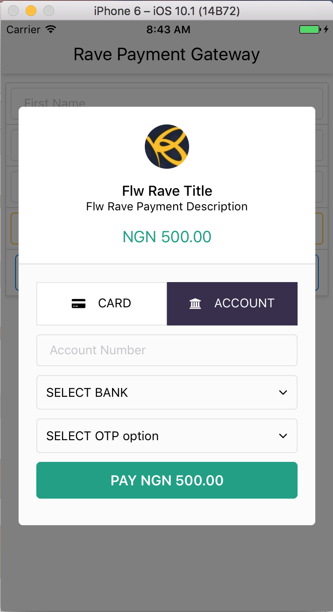
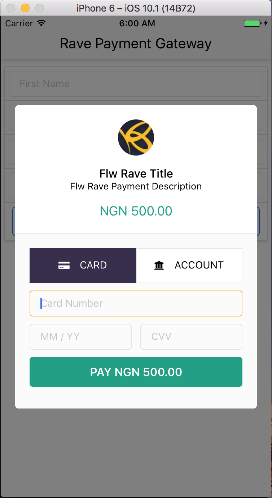

# RavePaymentGateWay
Rave payment gateway quick checkout for ReactNative application is an easy to implement plugin to interact with [Flutterwave](https://www.flutterwave.com/) payment API. It comes with in-built UI to collect debit card, credit card or bank details.

***

